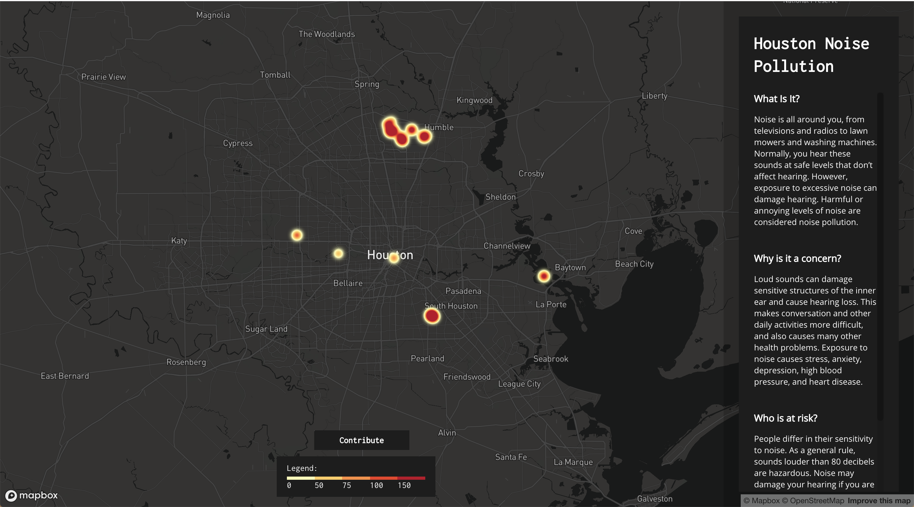
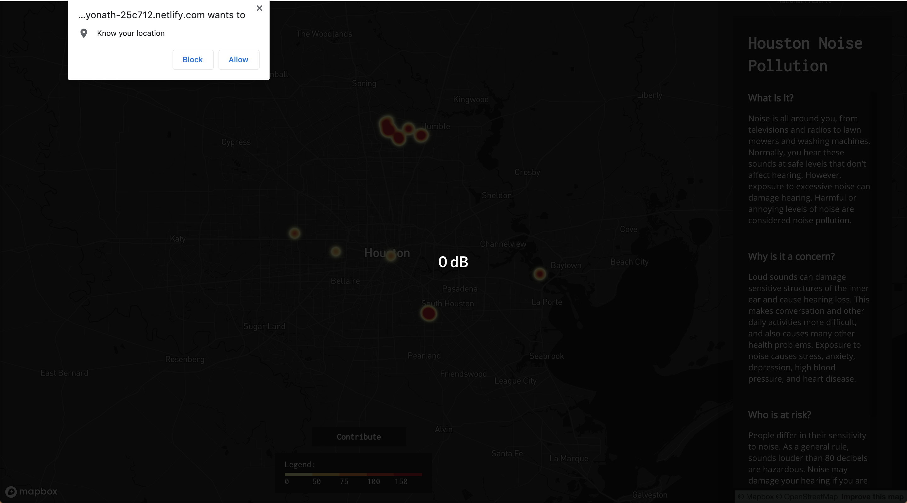

# H-Town Hubbub!
**H-Town Hubbub! is a 24 hour project designed by Richard Lorenzini, Gregory Priznar, Shaun Colley, Kanwal Kazmi, Kevin Peery, and Sean Wyse. The project was designed during a Houston Hackathon event.**

The website is live <a href="https://optimistic-yonath-25c712.netlify.com/">HERE.</a> 

# Watch It In Action

# How It Works
**Heat Map**

The application loads a heatmap with populated data from our database. The data shown represents user contributions of local decibel readings. The louder the reading, the more red the heatmap display. The more readings captured, the more dense the heatmap becomes. The map loads into the Houston area but can be utilized globally.

**Contribute Decibel Readings**

When you click on the **Contribute** button at the bottom of the page, the website checks for both geolocation and audio recording access. If one or neither are currently allowed, the website will ask you for premission to use them.

**NOTE:** the website only uses your location and audio recorder to upload an average decibel reading to the website's server. After the data is sent, the audio recorder is disabled and your location is not tracked.

**Mobile Responsiveness**

While on mobile, the application's descriptive bar on the right hand side is removed for ease-of-use. The application is fully functional on any mobile device, just as it would be on any desktop browser.
